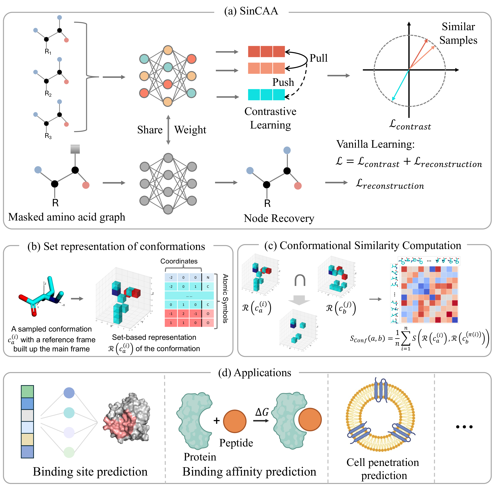

# 🧬 SinCAA

**Learning representations for peptides containing non-canonical amino acids (ncAAs).**  
This repository provides the implementation, pretrained models, and training pipeline for the paper:

> **"Similarity-Enhanced Representation Learning of Non-Canonical Amino Acids for Therapeutic Peptide Modeling"**  
> *Chencheng Xu et al., 2025*

---

## 🚀 Overview

Standard protein language models are typically trained only on canonical amino acids, which limits their capacity to model peptides containing ncAAs.
This project introduces SinCAA, a framework that integrates a 3D conformational similarity metric into a graph transformer trained with dual objectives—contrastive learning and masked-node reconstruction—to generate transferable molecular embeddings capable of generalizing from individual ncAAs to complete peptides.
SinCAA demonstrates strong performance across multiple downstream tasks, including peptide binding affinity prediction, cell-penetrating ability estimation, and protein–peptide binding site prediction. Notably, it achieves substantial improvements over existing methods and exhibits remarkable zero-shot generalization, underscoring its potential to accelerate therapeutic peptide discovery.

## 🔥 Quick start
To ensure reproducibility, all dependencies required for SinCAA can be installed via the provided environment.yml file.
Follow the steps below to create and activate the environment.

` conda env create -f environment.yml ; conda activate sincaa `

SinCAA relies on [OpenFold](https://github.com/aqlaboratory/openfold) for feature extraction. Please follow the official OpenFold installation instructions to install it properly.

The pretrained weights for SinCAA are available at:
` data/results/n1_weight0.1_innl2_both/`

To generate embeddings for peptides or amino acids from a CSV file containing molecular representations in the SMILES column, execute the following command:

``` 
python -m Tools.generate_emb_from_smiles \
    --csv_path path_to_file.csv \
    --pretrained_dir data/results/n1_weight0.1_innl2_both/ \
    --save_dir save_path.npy 
```


Here:
* --csv_path specifies the path to the input CSV file (e.g., data/examples/exam_csv.csv).

* --pretrained_dir provides the directory containing the pretrained SinCAA model weights.

* --save_dir defines the output path for saving the generated embeddings in NumPy format (.npy)

## 📂 Repository Structure
The structure of the SinCAA repository is as follows:
``` text
SinCAA/
├── data/                       # Datasets and pretrained model weights
│   ├── AAList/                 # Non-canonical amino acids for model pretrianing
│   ├── examples/               # Examples to show model inputs
│   └── results/                # Model outputs and pretrained weights
│       └── n1_weight0.1_innl2_both/
│
├── Tools/                      # Utility scripts and helper functions
│   ├── generate_emb_from_smiles.py   # Generate embeddings from SMILES strings
│   └── build_sim_aa.py         # Generate similar amino acids
├── Experiments/                      # Code for downstream experiments
│   ├── 0_benchmark   # Cell penetration ability prediction
│   └── 1_ppb   # Protein-peptide binding prediction
│
├── utils/                      # Utility functions for similarity calculations and data preparation
│   ├── data_utils.py           # Data loader utilities
│   ├── data_constants.py       # Constants for data preparation
│   ├── align_utils.py          # Utilities for protein chain alignment
│   ├── amino_acid.py           # Amino acid feature extraction utilities
│   ├── feats_acid.py           # Protein feature preprocessing utilities
│   ├── rigid_utils.py          # Utilities for rigid structure handling
│   ├── similarity_utils.py     # Utilities for conformational similarity calculation
│   ├── train_utils.py          # Utilities for model training
│   └── build_sim_aa.py         # Generate similar amino acids
│
├── models/                     # Model architectures
│   └── sincaa.py
│
├── figs/                  # Figures for README
│
├── scripts/                    # Shell scripts for training
│   ├── split_data.py          # Utilities for model training
│   └── train.sh
│
├── environment.yml             # Dependencies
├── README.md                   # Project overview and usage instructions
└── LICENSE                     # License information
```

### Usage
#### Model Training

Download the ZINC15 10M dataset from the official website. Split the training and validation datasets:

`python scripts/split_data.py path_to_zinc_data`


Start model training:

`bash scripts/train.sh`

#### Similarity Calculation

To calculate the similarity between a pair of non-canonical amino acids A and B:

```
from utils.similarity_utils import get_space_distance

grid_size = 1        # Recommended values: 0.5, 1, or 2
num_samples = 20     # Recommended: 20 or higher

similarity = get_space_distance(A, B, grid_size, num_samples=num_samples)
print(similarity)
```

#### Downstream Applications

For experiments related to downstream applications, please refer to the README in each folder under `experiments/`.